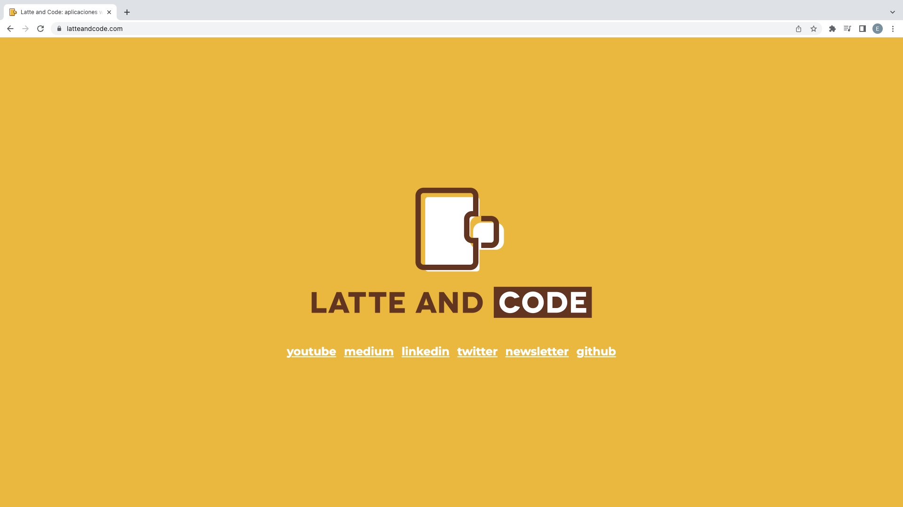
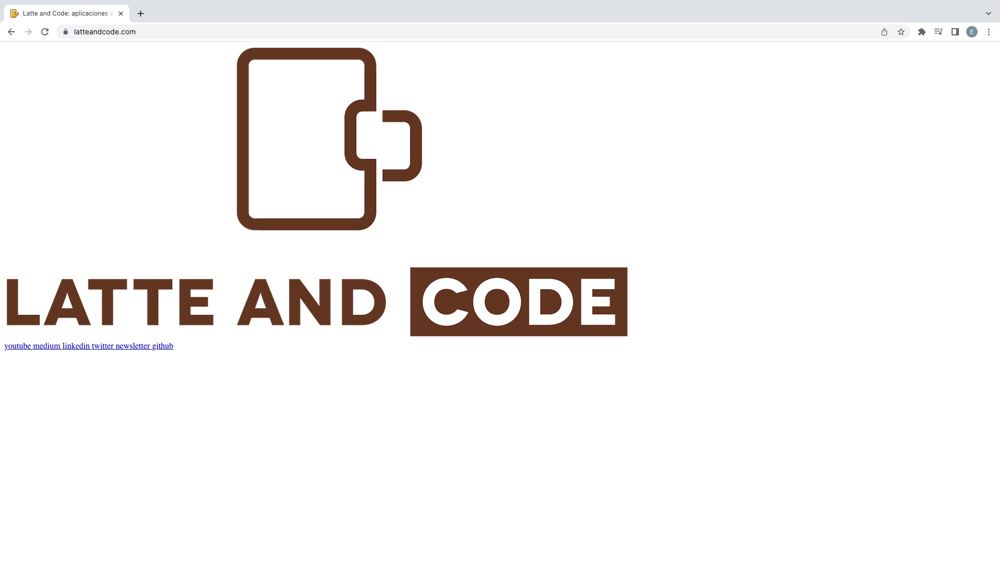

[DIAPOSITIVAS](S4-recursos/introduccion-css.pdf)

---

En esta cuarta sesión del prework nos metemos de lleno en CSS para ver como podemos aplicar estilos a nuestra página web.

- Empezamos con una pequeña introducción para ver las ventajas que nos aporta CSS
- Veremos las diferentes formas de aplicar estilos a las etiquetas HTML
- Daremos una visión global sobre los principales estilos que podemos aplicar a nuestro documento tanto a nivel de visualización de contenido como de estructuración
- ¡Haremos la landing de Netflix! Iremos paso a paso construyéndola juntos

**¿QUÉ ES CSS?**

CSS es un lenguaje de estilado que nos permite asignar estilos a nuestro HTML.

Podemos ver la diferencia de incluir estilado dentro de nuestra página web.

**CON CSS**



**SIN CSS**



**¿CÓMO TRABAJAMOS CON CSS?**

Para trabajar con CSS tenemos 3 opciones. SPOILER → Las dos primeras no las recomendamos.

- La primera opción es incluir directamente el atributo style dentro de nuestro código html, por ejemplo para cambiar el color de un título

```html
 <h1 style="color:blue;">Este es un título azul<h1>
```

- La segunda opción es incluir directamente código CSS dentro de nuestro HTML con la etiqueta ```<style>```

```html
<style>
  h1{
    color: blue;
  }
</style>
```

- La tercera opción  [  ESTA ES LA BUENA  ] es mediante un fichero CSS. Para ello lo creamos con la extensión .css dentro de nuestro proyecto. Una vez lo tengamos lo referenciamos dentro de nuestro documento HTML dentro de la etiqueta ```<head>```

```html
<link rel="stylesheet" href="./estilos.css">
```

En el siguiente vídeo vamos a ver cómo podemos seleccionar las diferentes etiquetas para aplicarles estilos.
