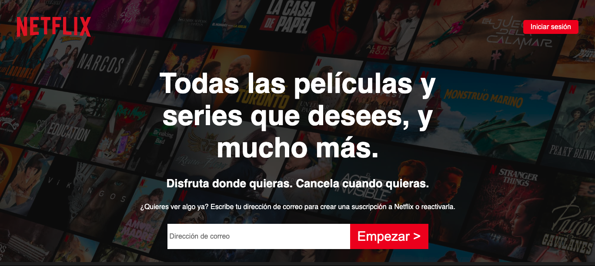
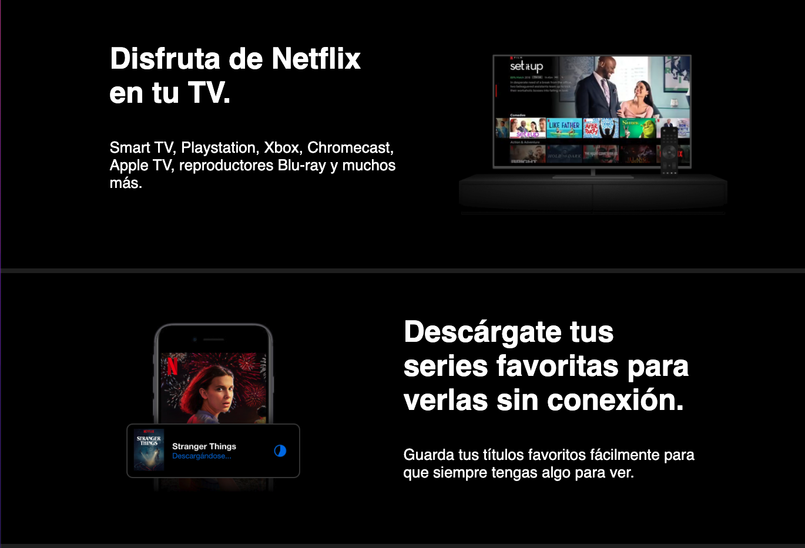
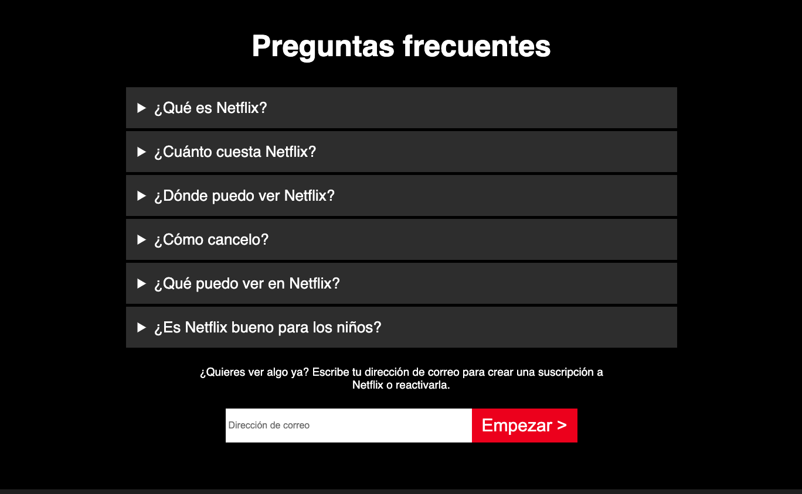
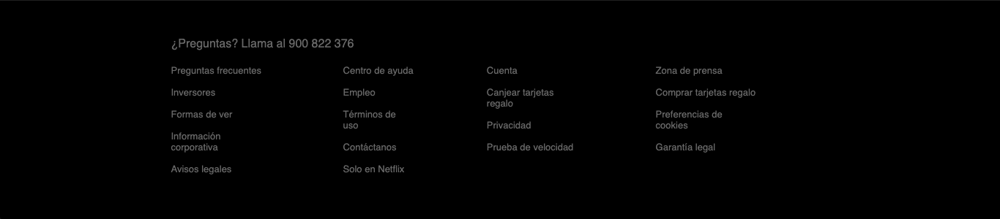

> [Landing Netflix](S4-recursos/landing-netflix.pdf)

> [Solución Netflix](S4-recursos/solucion-landing-netflix.zip)

---

Tras haber dado los conceptos básicos de CSS vamos a meternos de lleno y es que vamos a maquetar la página web de Netflix.

La landing en cuestión es esta:

> [Landing Netflix](S4-recursos/landing-netflix.pdf)

**ANÁLISIS INICIAL**

Como siempre que nos encargan un trabajo de estas características, antes de ponernos a trabajar tenemos que analizar en profundidad lo que nos están pidiendo, para hacernos una idea general y un esquema en la cabeza de la estructura, detalles que podemos ir pensando como hacer, cosas que no sabemos y tendremos que buscar…

Echando un ojo al proyecto vemos que tenemos 4 bloques bastante bien diferenciados a los que nos tendremos que enfrentar:

**BLOQUE INTRODUCCIÓN**

En este bloque diferenciamos 

- Un header con lo que es el logo de Netflix y un botón que nos llevaría a iniciar sesión.
- También vemos un título, un subtítulo y algo de texto
- Y por último un formulario para introducir tu correo electrónico y un botón.

**BLOQUE BANNERS**

Después del bloque de introducción vienen cuatro banners con características muy similares:

- Una imagen
- Un título publicitario
- Un poco de texto

Tiene elementos sencillos, tendremos que pensar bien como trabajamos el CSS para posicionarlo como nos piden

**BLOQUE FAQS**

¡ME EXPLOTA LA CABEZA! ¿Y esos desplegables de información? No os preocupéis, vamos a ver como hacerlos únicamente utilizando etiquetas de HTML y dándole estilos con CSS.

Tenemos también de nuevo un formulario, seguramente podamos reutilizar el de la introducción

**FOOTER**

Ya solo nos queda el footer. La complejidad aquí escribir tantos enlaces, ¡madre mía!

A nivel estructura tendremos que crear un contenedor para cada una de las columnas y ver como las posicionamos.

**¡VAMOS AL LÍO!** 

Hemos hecho un vídeo por sección para que sea más fácil de seguir.
