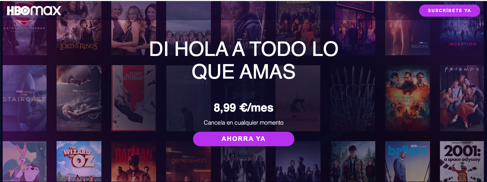
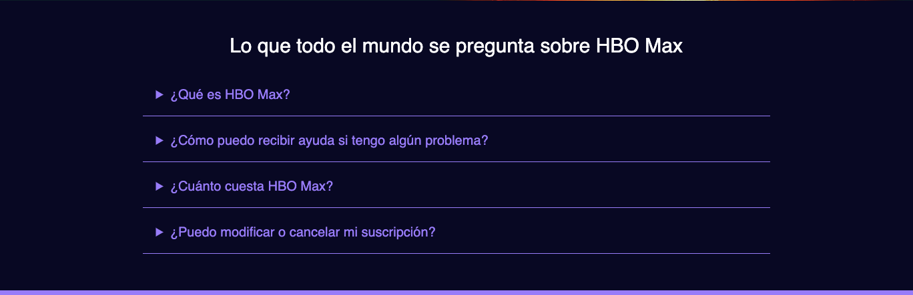

>[ENUNCIADO](S4-recursos/tarea-landing-hbo.pdf)

>[RECURSOS](S4-recursos/hbo-recursos.zip)

---

**¡HA LLEGADO EL MOMENTO!** Es vuestro turno, tras realizar conjuntamente la landing de Netflix os toca poneros manos a la obra para maquetar con éxito la de HBO.

Tener paciencia, Roma no se hizo en un día, y son un montón de conocimientos que asimilar en estas sesiones.

Landing a realizar:

[Landing HBO](S4-recursos/tarea-landing-hbo.pdf)

Para que os resulte más sencillo y claro, os vamos a dar una serie de tips y una división de como entendemos que hay que trabajar los bloques.

## BLOQUE INTRODUCCIÓN

Es un bloque muy similar al de la web de Netflix:

- Tenemos un header con un logo y un botón
- Una imagen de fondo en toda la sección
- Títulos, texto y otro botón

```css
/* Ayuda propiedades CSS */

border-radius: 50px; /* utilízalo para que los botones queden redondeados */
background-color: rgb(181, 53, 246); /* Color del botón */
letter-spacing: 2px; /* Permite poner espacios en el texto*/
background-color: rgba(3,3,40,0.4); /* Nuestro header tiene un fondo con esta opacidad y color*/

/* Propiedades que nos ayudan a posicionar el los elementos del header */

display:flex;
align-items: center;
justify-content: space-betwwen;
```



## BLOQUE VALUE PROPOSAL

Este bloque es muy sencillo, tenemos que maquetar un título y un texto:


## BLOQUE BANNER

También hay un par de banners tienen una imagen en el lateral y un bloque que contiene una imagen, un texto y un botón.


La diferencia entre los bloques es que cambia el color de la letra y fondo, podemos hacer una clase genérica que nos coja el resto de propiedades y poner unas específicas para los colore y fondo en cada banner.

```css
background-color: #0A1E2B; /* Color del fondo del banner */
```

## BLOQUE FAQS

¡Ya hemos aprendido a hacerlos así que no hay excusa! 



```css
/* Ayuda propiedades CSS */

color:rgb(158, 134, 255);
```

## FOOTER

Ya solo nos queda el footer. 


```css
/* PISTA */

display: flex;
justify-content: center;
```

**¡A POR ELLO!** 
